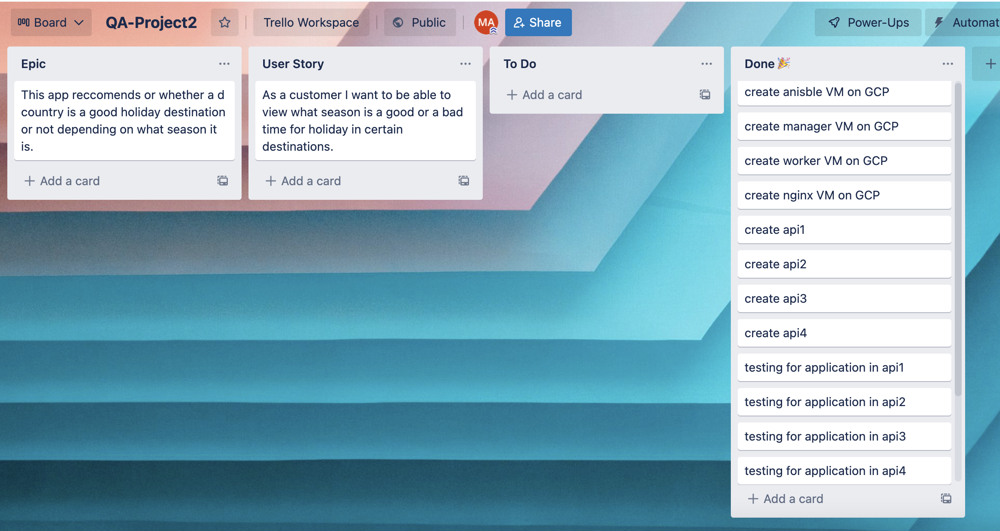
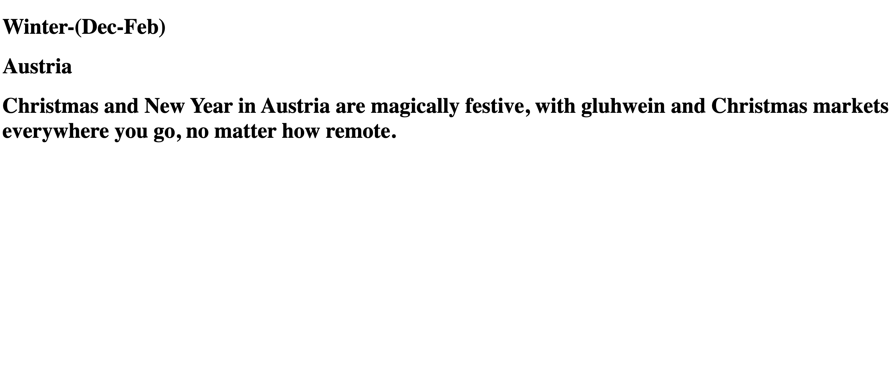
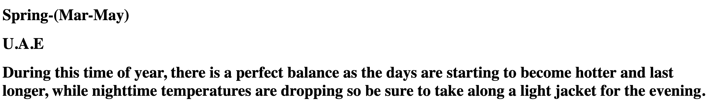
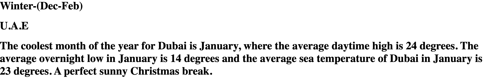
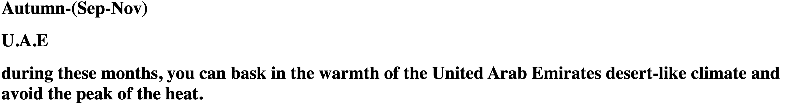
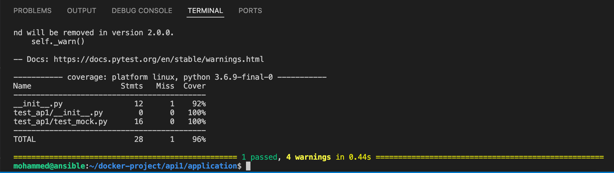
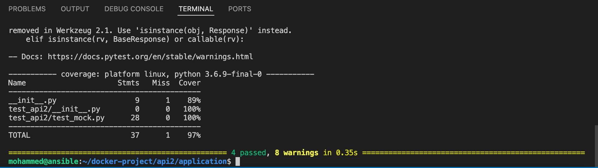
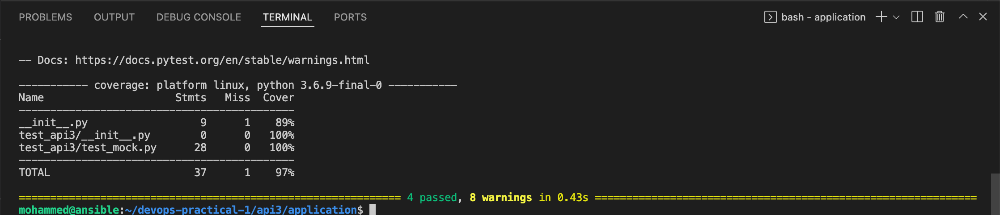
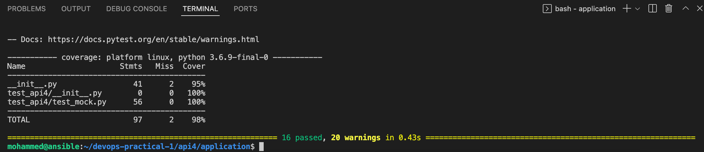

# Holiday Review Generator

### Author

Mohammed Azim

#### Video Presentation:

#### Notes:
This is my documentation for my project as part of QA Ltd MarEnable22 training team. The purpose of this README.md is to outline my Devops core practical project.

## Table of Contents

* [Brief](#brief)
    * [My Approach](#approach)
    * [Architecture](#architecture)
    * [Requirements](#Requirements)
* [Application Design](#design)
    * [Kanban Board](#kanban-board)
    * [Risk Assessment](#risk-assessment) 
    * [CI Pipeline](#pipeline)
* [Front-end](#front-end)
* [Testing](#testing)
* [Future Improvements](#future-improvements)
* [My Acknowledgements](#my_acknowledgements)
* [Licence](#licence)

## Brief

 I have been assigned to create an application that generates “Objects” upon a set of predefined rules. The end outcome will be a randomized service orientatied application. It will contain 4 services each working together ustilising the supporting tools and technologies that have been covered during the QA training course. 

### My Approach

My approach for this practical project was to create a random holiday review generator based on what season and specific destination are selected by the genereator. 
 
### Architecture

A service-orientated architecture for application, as stated it must be composed of 4 services that all work together.

Service 1 is the main core service of the application. It will render Jinja2 templates which will be needed to interact with the application. Jinja2 is also whats needed for communication between the remaining 3 services.

Service 2 + 3 Both generate a random “Object”, an example of what these can be a random number or random letter, pulling an item from Aaray.

Service 4 is the last service which will show a result of the combination of services 2 + 3  using some pre-defined rules. 

### Requirements

The requirements of the project are as follows:

1. An Asana board (or equivalent Kanban board tech).

2. The project must follow the Service-oriented architecture that has been asked for.

3. Application must be fully integrated using the Feature-Branch model into a Version Control System which will then be built through a CI server and deployed to a cloud-based virtual machine.

4. If a change is made to a code base, then Webhooks should be used so that Jenkins recreates and redeploys the changed application.

5. The project must be deployed using containerisation and an orchestration tool.

6. As part of the project, you need to create an Ansible Playbook that will provision the environment that your application needs to run.

7. The project must make use of a reverse proxy to make your application accessible to the user.

## Application Design

### Kanban Board

My project tracking was saved via a kanban board via trello which I used to keep on track with the project.

### Risk Assessment

Above is my risk assessment that I might have come across during thr creation of the application, dockerisation

### CI Pipeline

The CI pipeline above lists all associated frameworks of the project used and shows rapid development to development as it automates the integration process and push to github with minimal effort. This procress is handled by Jenkins via a webhook. Testing is the main focus of the automation process. Any code pushed to GitHub will then automatically be pushed to Jenkins.

## Front-end

The above images are of the front-end of my app. the first to objects being season and destination whilst the third row is the holiday review for that combination. 

## Testing

Below is each unit pytests for all 4 services with the coverage scores

## Future Improvements

Firstly, time management is key and I misjudged the complexity of this project making me very constrained on time.

For future improvements I would like to expand the list of countries a lot. 

The visual aesthetic of the website can improve a great deal, however, my coding abilities 